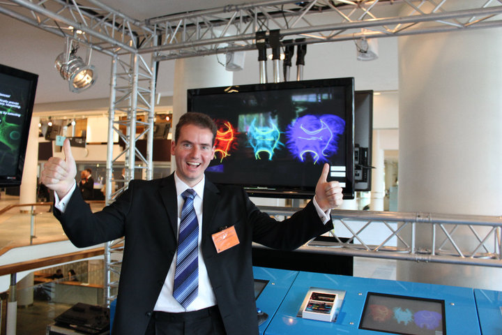

=====
About
=====

Dr. Eleftherios Garyfallidis is a passionate engineer/inventor/visionary building the future of computational anatomy. In 2009, he started a revolutionary open source project called `Diffusion Imaging in Python (DIPY) <http://dipy.org>`_. Under his leadership, `DIPY <http://journal.frontiersin.org/article/10.3389/fninf.2014.00008/abstract>`_ grown to a multinational and dynamic project with many enthusiastic contributors and a large user-base. DIPY filled a large gap in the neuroscientific community because there was no other software library that was truly international. Until DIPY's rise, every lab was promoting their own poorly tested and badly documented internal tools. Today, DIPY brings together the best of software engineering and the best scientists around the world contributing in the same codebase. So you can think of it as something between the Manhattan Project and the Linux Kernel for medical imaging.

Apart from leading the development of DIPY, Dr. Garyfallidis have performed research on nearly all levels of diffusion MRI (dMRI) analysis. dMRI is an MRI technique that can be used to study non-invasively the structural connectivity of the brain and other biological tissue types. Recently, he started focusing more on the problems of segmentation and registration of tractography using only streamline information. These are nontrivial problems mainly because they are new. Although the scientific community has acquired knowledge of many decades on how to process images but not how to process streamlines. Which is great because that means their is plenty of space for innovation. Some of Dr. Garyfallidis greatest inventions include `QuickBundles <http://journal.frontiersin.org/article/10.3389/fnins.2012.00175/abstract>`_ an algorithm for efficient simplification of tractographies and `Streamline-based Linear Registration (SLR) <http://www.sciencedirect.com/science/article/pii/S1053811915003961>`_ a method for linear registration of bundles and creation of bundle-specific atlases.

Dr. Garyfallidis holds a PhD in medical imaging from the University of Cambridge, United Kingdom, and he is currently working as a Postdoctoral researcher at the wonderful and dynamic lab of Professor Maxime Descoteaux, at the University of Sherbrooke in Canada and of course continue leading the international development of DIPY. Nonetheless, Dr. Garyfallidis is a keen participant in scientific competitions. In 2013 he lead a team of scientists to win the international IEEE HARDI reconstruction competition.

For more information here is Dr. Garyfallidis `CV <../pdfs/garyfallidis_CV_2015.pdf>`_.

.. The picture on the right is from 2010 at a scientific exhibition that Dr. Garyfallidis participated while a PhD student at Cambridge. This exhibition was for the celebration of the 350 years of the Royal Society in London, UK. In the screen behind him you see three tractographies showing a scientific problem which kept him busy for some time. The important question here is: How a neuronal bundle from one brain corresponds to a neuronal bundle of other brains? If you click this picture it will redirect you to a video of the demonstration that we were showing to the general public during the exhibition. This video although low resolution gives a nice overview of the topic that Dr. Garyfallidis has been working on without getting into the technical details. The voice over is from Dr. Ian Nimmo-Smith who was my PhD supervisor. Enjoy!

Contact
========

The easiest way to contact Dr. Garyfallidis for:

* research questions, collaborations and media inquiries is by sending an e-mail to ``garyfallidis@gmail.com``.

* questions concerning DIPY please send directly an e-mail to ``neuroimaging@python.org``.

* urgent issues find the rest of his contact details in his `CV <../pdfs/garyfallidis_CV_2015.pdf>`_.

