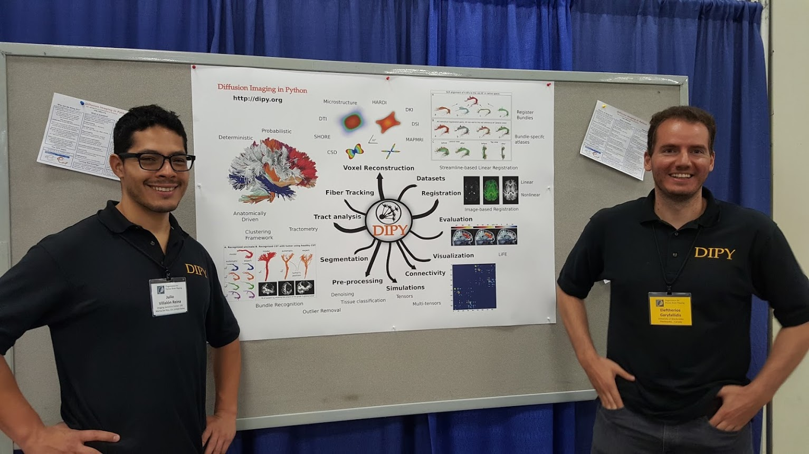
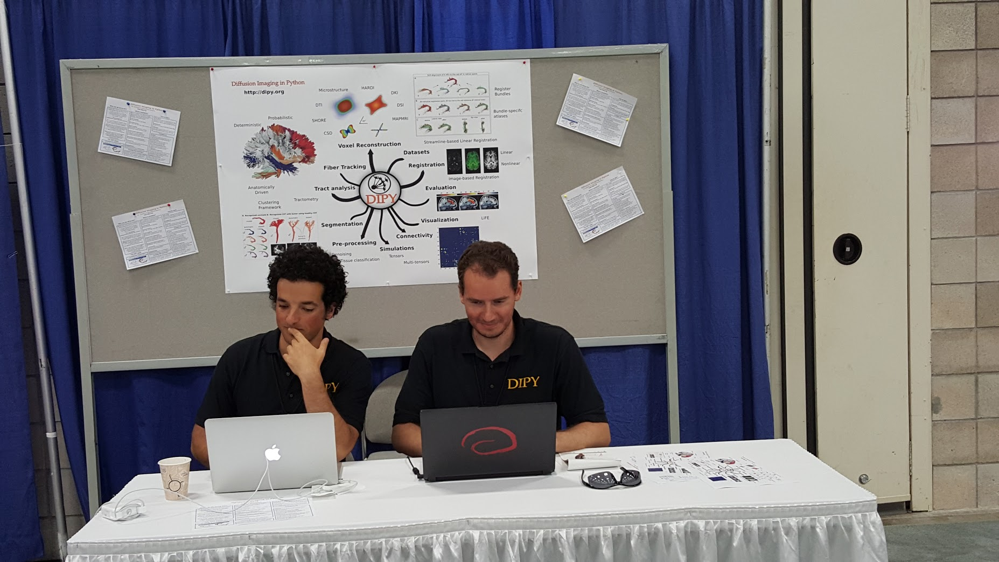
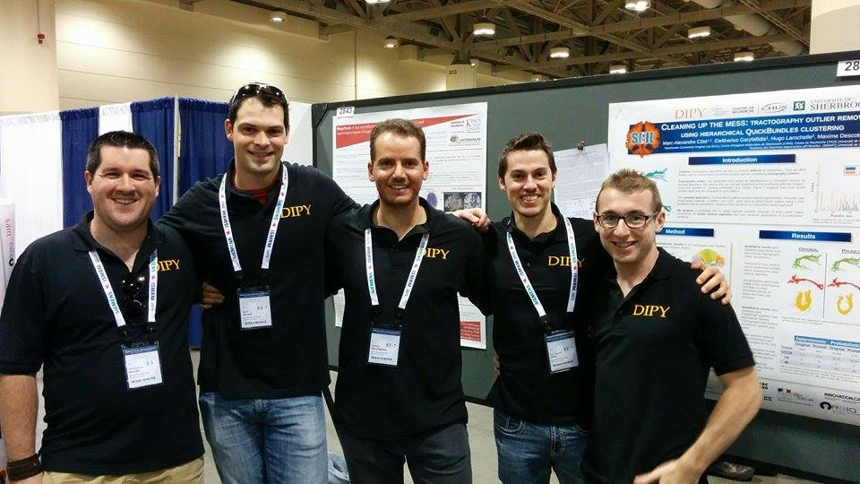
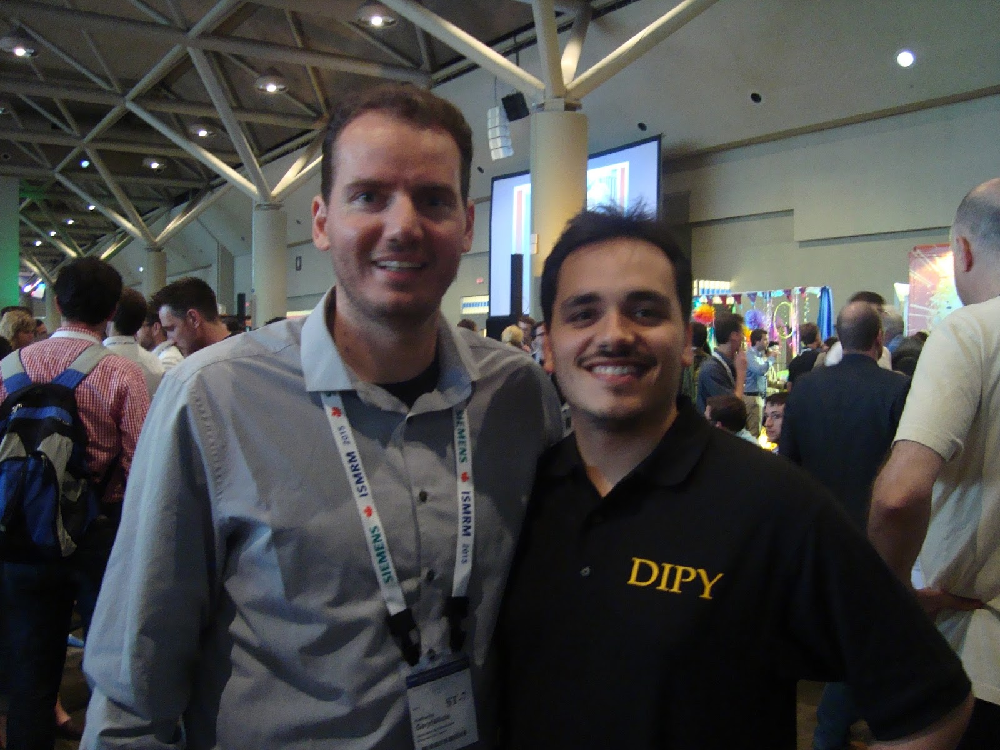
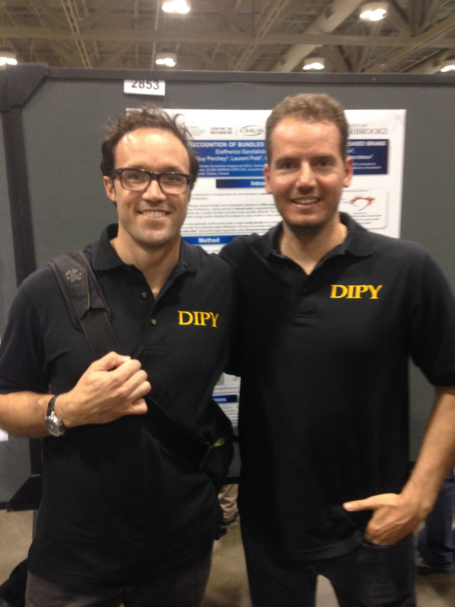
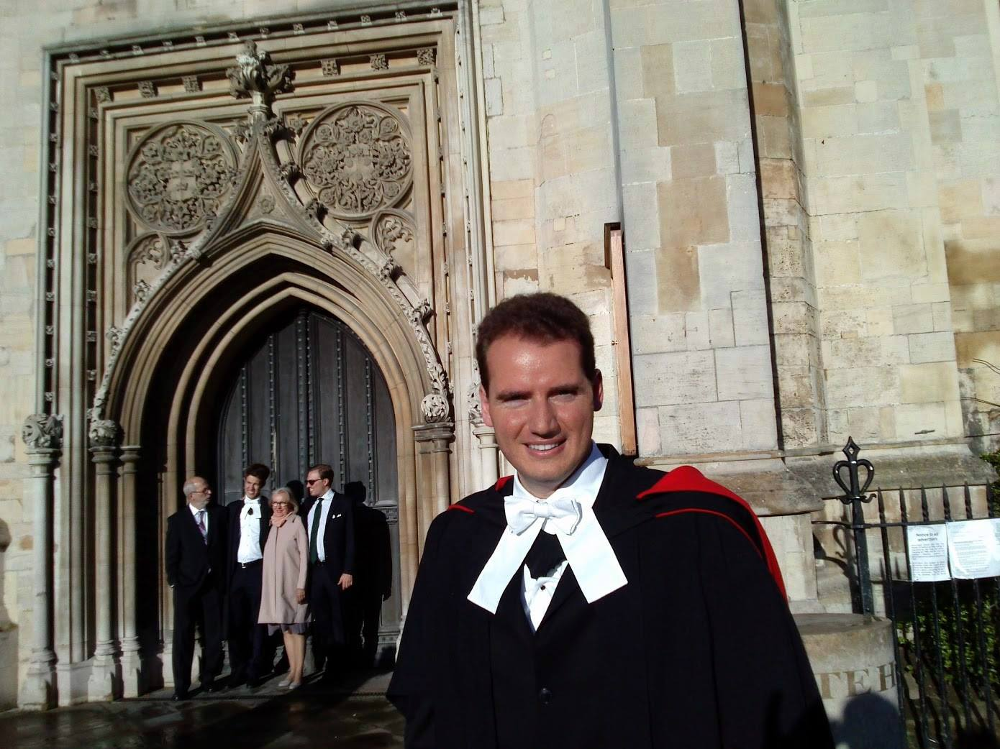
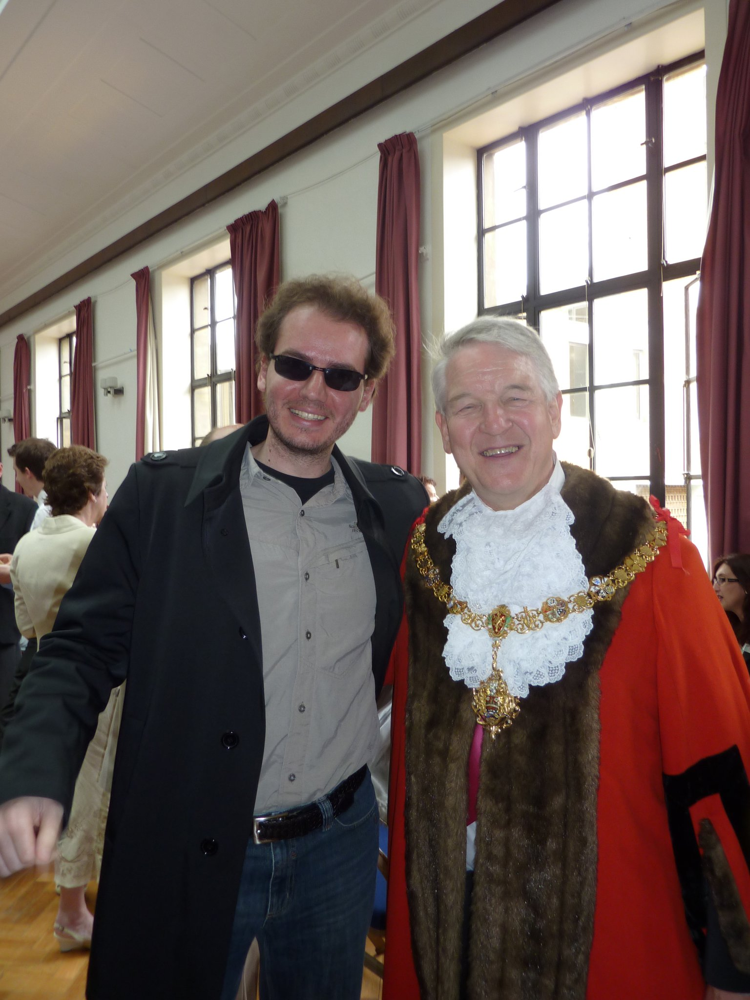

=======
Gallery
=======

Honolulu, Hawaii 2015
=====================

During OHBM 2015 in front of our exhibition booth together with Julio Villalon. Julio is one of Google Summer of Code (GSoC) students and a PhD student at Paul Thompson's group at USC. 
I am mentoring him this year with DIPY for GSoC.

We had some great fun with Julio in the booth talking with people but also during the OHBM hackathon!

|

Hacking time! With great friend and co-developer at DIPY Dr. Ariel Rokem.

Toronto, Canada 2015
=====================

During ISMRM 2015 together with some of the younger members of the DIPY crew. From left to right you see Jean Christophe Houde, Gabriel Girard, Eleftherios Garyfallidis, Marc-Alex Cote and Francois Rheault.

|

With Rafael Henriques who is participating at GSoC 2015 with DIPY. Rafael is a PhD student at the University of Cambridge.

|

With my great friend and Postdoctar mentor Professor Maxime Descoteaux. 

Cambridge, UK 2012
===================

During my PhD graduation. A happy man!

Cambridge, UK 2011
===================

My PhD supervisor Dr. Ian Nimmo-Smith becomes Mayor of Cambridge! 

