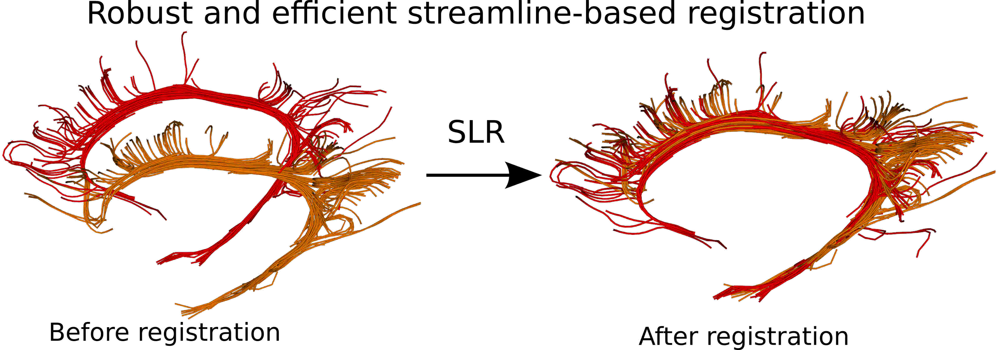
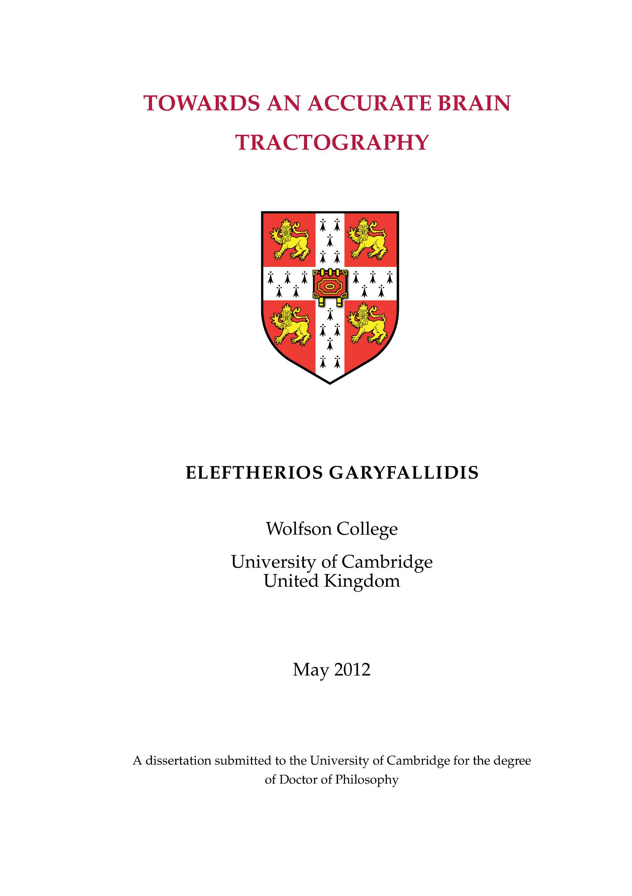

============
Publications
============

The complete list of my publications can be found in my 
`CV <../pdfs/garyfallidis_CV_2015.pdf>`_ and in my 
`Google Scholar page <https://scholar.google.ca/citations?user=Ln2EyRYAAAAJ&hl=en>`_. 

Journals
--------

#. **Garyfallidis, E**., O. Ocegueda, D. Wassermann, M. Descoteaux.
   `Robust and efficient linear registration of fascicles in the space
   of streamlines <http://www.sciencedirect.com/science/article/pii/S1053811915003961>`_ , Neuroimage, 117:124-140, 2015.

#. Ocegueda, O., **E. Garyfallidis**, M. Descoteuax, M. Rivera.
   *“Symmetric Diffeomorphic Registration with Expected
   Cross-Correlation for Multi-Modal MRI”*, Medical Image Analysis
   (submitted), 2015.

#. Renaud, E. M. Descoteaux, M. Bernier, **E. Garyfallidis**, K.
   Whittingstall, *“Morphology of thalamus, LGN and optic radiation do
   not influence EEG alpha waves”*, Brain function and structure
   (submitted), 2015.

#. Porro, D., E. Olivetti, B. Thien, **E. Garyfallidis**, P. Avesani,
   *“Visual Data Mining Tool for Brain Connectivity Analysis”*, Data
   Mining and Knowledge Discovery, 2015.

#. Newcombe, V., M. Correia, C. Ledig, G. Giulia, J. Outtrim, D.
   Chatfield, T. Geeraerts, A. Manktelow, **E. Garyfallidis**, J.
   Pickard, B. Sahakian, P. Hutchinson, D. Rueckert, J. Coles, G.
   Williams, D. Menon, *”Dynamic changes in white matter abnormalities
   correlates with late improvement and deterioration following TBI: A
   diffusion tensor imaging study*\ ”, Neurorehabilitation & Neural
   Repair, 2015.

#. **Garyfallidis, E.**, M. Brett, B. Amirbekian, A. Rokem, S. Van Der
   Walt, M. Descoteaux, and I. Nimmo-Smith. `Dipy, a library for the
   analysis of diffusion MRI data <http://journal.frontiersin.org/article/10.3389/fninf.2014.00008/abstract>`_. Frontiers in Neuroinformatics, 1-18, 2014.

#. Daducci, A., E. Canales-Rodriguez, M. Descoteaux, **E.
   Garyfallidis**, Y. Gur, Y-C. Lin, M. Mani, S. Merlet, M. Paquette, A.
   Ramirez-Manzanares, M. Reisert, P. Rodrigues, F. Sepehrband, E.
   Caruyer, J. Choupan, R. Deriche, M. Jacob, G. Menegaz, V. Prckovska,
   M. Rivera, Y. Wiaux, and J-P. Thiran. *Quantitative comparison of
   reconstruction methods for intra-voxel fiber recovery from diffusion
   MRI.* Transactions in Medical Imaging, 33 (2): 384-399, 2014.

#. Cote, M-A., G. Girard, A. Bore, **E. Garyfallidis**, J-C. Houde, and
   M. Descoteaux. *Tractometer: Towards Validation of Tractography
   Pipelines.* Medical Image Analysis, 17 (7): 844-857, 2013.

#. **Garyfallidis, E.**, M. Brett, M. M. Correia , G.B. Williams, I.
   Nimmo-Smith. `QuickBundles, a method for tractography
   simplification <http://journal.frontiersin.org/article/10.3389/fnins.2012.00175/abstract>`_. Frontiers in Neuroscience, 6-175, 2012.

#. Tsiaras, V., P.G. Simos, R. Rezaie, B.R. Sheth, **E. Garyfallidis**,
   E.M. Castillo, A.C. Papanicolaou, *Extracting biomarkers of autism
   from MEG resting-state functional connectivity networks.*, Computers
   in biology and medicine 41(12): 1166-77, 2011.

#. Chamberlain S.R., A. Hampshire, L.A. Menzies, **E. Garyfallidis**,
   J.E. Grant, B.L. Odlaug, K. Craig, N. Fineberg, B.J. Sahakian,\ *
   Reduced brain white matter integrity in trichotillomania: a diffusion
   tensor imaging study.*, Archives of General Psychiatry 67(9): 965-71,
   2010.

PhD Thesis
----------

**Garyfallidis, E.**, `"Towards an accurate brain tractography" <https://dl.dropboxusercontent.com/u/2481924/thesis.pdf>`_, University of Cambridge, 2012. 
