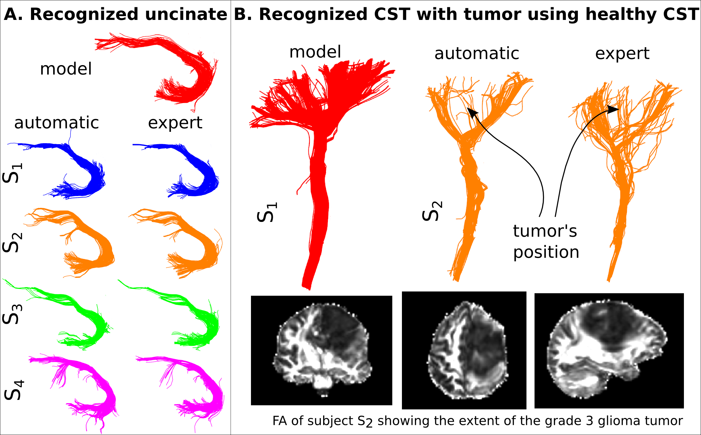
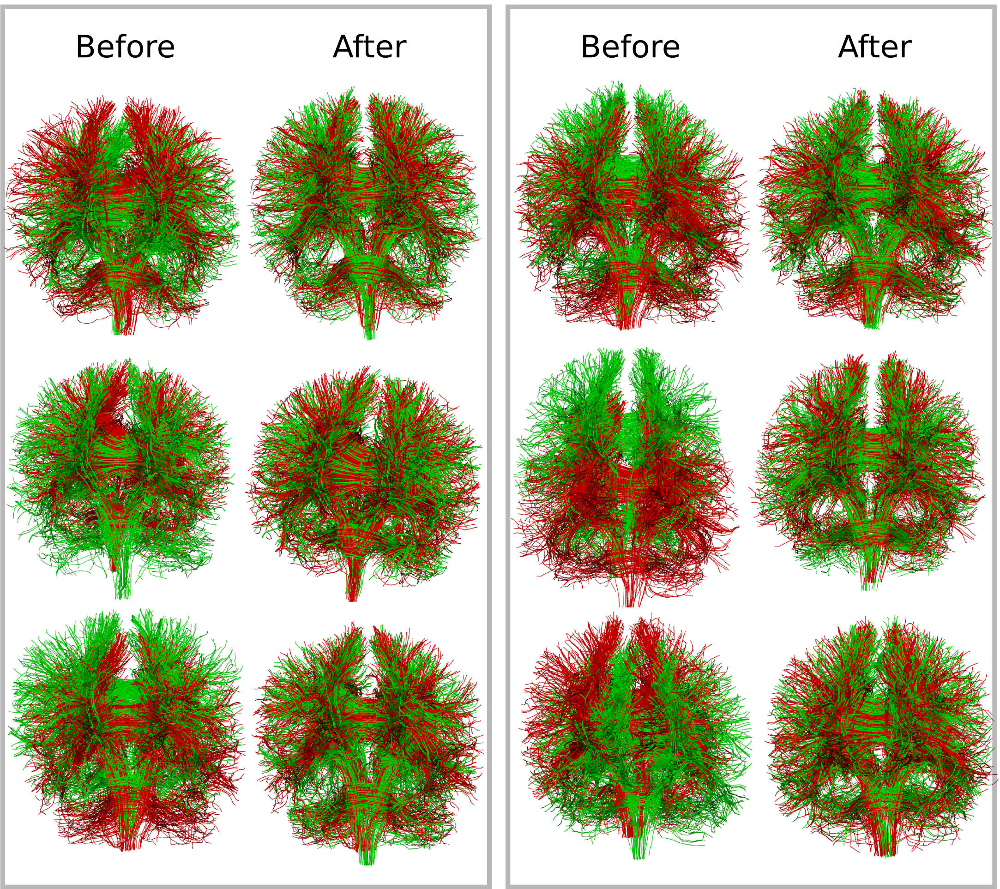

========
Research
========

My research topics are: medical imaging, machine learning, signal processing, scientific visualization and software engineering. More specifically, I focus on the development of new methods from these topics applied to diffusion MRI analysis for generic applications e.g., understanding the structural connectivity of the brain and specific applications e.g., Alzheimer's disease, obsessive compulsive disorder or brain tumors. 

Summary of research contributions
=================================

I have contributed new methods for nearly every level of diffusion MRI analysis: voxel reconstruction, fiber tracking, tractography segmentation, and registration of bundles and images. Recently I have been looking into the problem of statistical analysis of bundles. However, the areas for which I believe I have contributed the most are those of (a) tractography segmentation with the invention of QuickBundles [2]_ and (b) registration of fascicles with the invention of Streamline-based Linear Registration (SLR) [3]_. Finally, I have contributed to making available cutting-edge methods to the scientific community by creating, developing and managing the Diffusion Imaging in Python (DIPY) [1]_ project which has an enthusiastic and active team of 34+ contributors from different labs around the world.

These days I am working on improving the analysis methods of diffusion MRI. More specifically, working on analyzing the output of fiber tracking algorithms. Currently, there are some important open problems with fiber tracking: a) it is difficult to assess the quality of fiber tracking, b) it is very time consuming for neuroscientists to interact with the output fiber tracks and extract bundles of interest, c) the analysis procedures for group comparisons are underdeveloped compared to the richness of information available in modern diffusion datasets. I am confident that these problems can be solved or improved considerably by creating methods that can automatically or semi-automatically discover bundles and do statistical analysis directly on these bundles rather than on the entire brain as is mostly used today. I separate my methodology into two sections; bundle recognition and bundle analytics.

Bundle recognition, detection and discovery
============================================

In May 2015, I presented a new method at the International Symposium of Magnetic Resonance in Medicine (ISMRM) that is able to detect bundles automatically given a model of a bundle. For example, if a neuroanatomist segments manually the uncinate fascicle in one brain (see Fig. 1A), she can use my new method to automatically detect the uncinate in other brains. The method is as good as and often better than having the expert doing the segmentations manually and can be used even in brains with large aggressive tumours. See for example how we automatically detect the corticospinal tract (CST) in a patient with a grade 3 glioma (Fig. 1B). 

This novel method opens new horizons on performing and automating segmentation of white matter. I am now improving this method and exploring its potentials with my colleagues so that in the next years we have as many bundles as possible automatically identified in a clinically acceptable timescale. For example, a neurosurgeon operating on the patient of Fig. 1B could immediately see the CST bundle and avoid damaging it while operating to remove the tumor. 

Furthermore, a new better version of this method could be used to discover bundles that are not commonly reported in the literature. For example, Catani et al. [8]_ recently discovered the frontal aslant tract and Yeatman et al. [9]_ rediscovered the vertical occipital fasciculus which had not been reported in the literature for decades. These scientists managed to discover these bundles after large amount of tedious manual work. I believe that discovery of bundles can be fully automated and we be able to build a dynamic and ever updating atlas of bundles in the same way that, in astronomy, there are satellites which discover new stars not previously recorded.

.. Figure 1: Discovering bundles in healthy and severely diseased brains.
.. Bundle analytics

Registration of bundles
========================

Recently, I invented a method that allows researchers to register bundles of the same type directly between subjects [3]_,[4]_ and create templates of bundles of the same type for group comparisons. For example in Fig. 2 we show how we created a probabilistic atlas of the optic radiation using our novel registration method.

During the next years, using this method, I plan to create a new statistical analysis method for group comparisons which will give a much more detailed information about the differences found in these bundles from what is available today. For example, I will look at analyzing specific parts of the bundles by looking at microstructure properties like axonal diameter [7]_ or more common measures like fractional anisotropy and mean diffusivity. 

I am hoping in this way to create a new framework for group comparisons which will be more informative and scientifically sound that the current state-of-the-art, e.g., tract-based statistics (TBSS) [5]_ and tract specific analysis (TSA)[6]_. I call this new field bundle analytics because it includes machine learning, mathematical optimization and statistical analysis all as one compact automated solution. 

Improving human health with translational outcomes
==================================================

Until today, I worked with my collaborators in examining traumatic brain injury, trichotillomania and autism using dMRI (see publications in my CV). However, during the last year of my Postdoctoral fellowship I collaborated on an exciting aging study with Prof. Stephen Cunnane [10]_ testing the hypothesis that a ketone enriched diet can reduce the effects of Alzheimer’s disease. This project is possibly leading to an important new approach for characterising the neuroanatomical features of the progression with a biomarker based on identifying microstructural changes in specific bundles. I believe, similar hypotheses can be tested for many other diseases. I am looking forward for ideas and collaborations from the different experts, who have accumulated decades of expertise looking into how the brain functions, so that we can clearly extend the clinical usage of dMRI from mainly used as a method for examining stroke, into creating new generations of advanced biomarkers which can evaluate therapies. I believe this is a realistic expectation and we should be able to show this in the coming years.

References
==========

.. [1] Garyfallidis, E., M. Brett, B. Amirbekian, A. Rokem, S. Van Der Walt, M. Descoteaux, and I. Nimmo-Smith. “Dipy, a library for the analysis of diffusion MRI data”. Frontiers in Neuroinformatics, 1-18, 2014.
.. [2] Garyfallidis, E., M. Brett, M. M. Correia , G.B. Williams, I. Nimmo-Smith. "QuickBundles, a method for tractography simplification.", Frontiers in Neuroscience, 6-175, 2012.
.. [3] Garyfallidis, E., O. Ocegueda, D. Wasserman, and M. Descoteaux. “Robust and efficient registration of white-matter fascicles in the space of streamlines”. Neuroimage, 2015 (accepted, under publication). 
.. [4] Garyfallidis, E., D. Wassermann, and M. Descoteaux. "Direct native-space fiber bundle alignment for group comparisons.", Proceedings of: International Society of Magnetic Resonance in Medicine (ISMRM). Milan, Italy. 7796, 2014.
.. [5] Smith, S.M., M. Jenkinson, H. Johansen-Berg, D. Rueckert, T.E. Nichols, C.E. Mackay, K.E. Watkins et al., "Tract-based spatial statistics: voxelwise analysis of multi-subject diffusion data." Neuroimage, 31(4) 1487-1505, 2006.
.. [6] Yushkevich, P.A., Zhang, H., Simon, T.J., Gee, .J.C., “Structure-specific statistical mapping of white matter tracts”, NeuroImage, Jun; 41(2):448-61, 2008. 
.. [7] Daducci, A., E.J. Canales-Rodríguez, H. Zhang, T.B. Dyrby, D.C. Alexander, and J.P. Thiran. "Accelerated Microstructure Imaging via Convex Optimization (AMICO) from diffusion MRI data.",  105 : 32-44, 2015.
.. [8] Catani, Marco, Flavio Dell’Acqua, Francesco Vergani, Farah Malik, Harry Hodge, Prasun Roy, Romain Valabregue, and Michel Thiebaut De Schotten. "Short frontal lobe connections of the human brain.", Cortex 48, no. 2: 273-291, 2012.
.. [9] Yeatman, J.D., K.S. Weiner, F. Pestilli, A. Rokem, A. Mezer, and B. A. Wandell. "The vertical occipital fasciculus: A century of controversy resolved by in vivo measurements.", Proceedings of the National Academy of Sciences 111, no. 48 : E5214-E5223, 2014.
.. [10] Cunnane, S. et al., “Brain fuel metabolism, aging, and Alzheimer’s disease”, Nutrition, 27:1, 3-20, 2011. 
