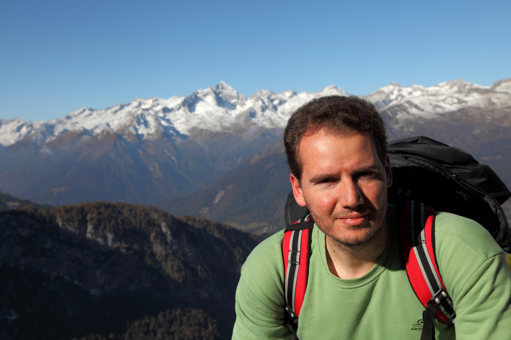

======================================
Eleftherios Garyfallidis, PhD
======================================
.. |Dr| image:: figures/face.jpg
        :width: 100px

.. raw:: html
        
        <H2 align="center"> 
        I create tools to navigate the super-highways of the human brain. 
        </H2>

I am a Greek computer scientist with a PhD in brain imaging from the University of Cambridge, and I am currently working as a post-doctoral researcher at the wonderful and dynamic lab of Professor Maxime Descoteaux, at the University of Sherbrooke in Canada. 

In 2009, I started a free and open source Python project called Dipy. Dipy focuses on advancing our current understanding of brain mapping using diffusion MRI (dMRI). dMRI is an MRI technique that can be used to study non-invasively the structural connectivity of the brain and other tissue. 

Today, Dipy has grown to a multinational and dynamic community with many enthusiastic contributors. Apart from leading the development of Dipy, I have performed research on nearly all levels of dMRI analysis and recently I concentrate more on the problems of segmentation and registration. Last year I also won the international IEEE HARDI reconstruction competition. `Here is my CV <garyfallidis_CV_2014.pdf>`_.

By clicking the three figures below you can go to Dipy.org, get my PhD thesis or find my Facebook page.

.. Science
.. ==========

.. image:: figures/pretty_tracks.png
    :align: center
    :width: 800px
    :target: http://dipy.org

.. Education
.. ===========

.. image:: figures/cambridge_university.jpg
    :align: center
    :width: 800px
    :target: http://dl.dropbox.com/u/2481924/thesis.pdf

.. Personal
.. ========

